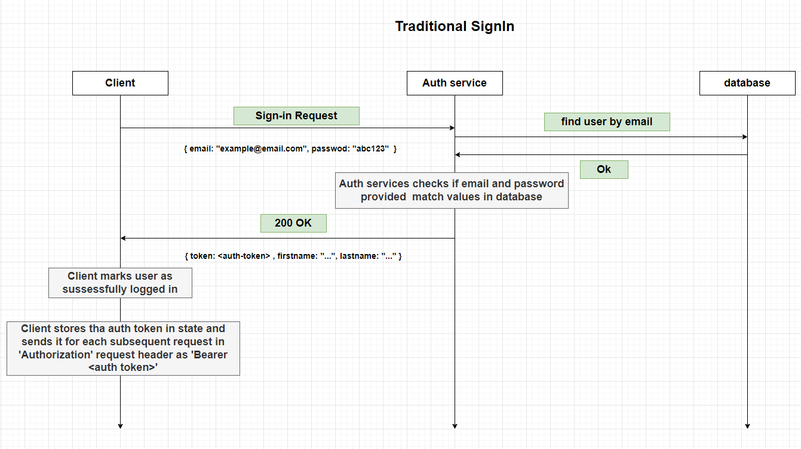

# Authentication flows

In Version 1 of the app we are going to have 2 methods that user can sign in or Sign up with ,

1. Traditional authentication
2. Google authentication

## Traditional Authentication

In traditional Signup and Login, mainly email + password or username-password combo is used for authentication and for registration some additional information is asked such as - first name , last name, birthdate or username etc. I am not going for phone number- OTP authentication because that needs a paid service that can delivery sms internationally. We might add it later on.

### Sign up

### Sign in

## Google Authentication

With Sign-in with google feature , users can use their existing google accounts to sign in or register to apps that implement this feature.

### Sign up

### Sign in

## Email Service

We will setup a temporary gmail account id for now to send emails and will use AWS SES sandbox / Free tier to send emails.

## User Schema

## Features planned for later

1. Facebook / Twitter / Instagram Sign in | Sign up.
2. Traditional Auth using phone number and OTP.
